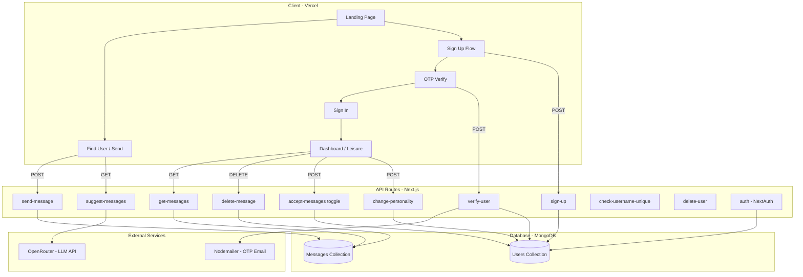

**✈️ PaperPlane**


> A Next.js anonymous messaging app — like passing notes in class, but for the internet. An NGL-inspired clone built to go deep on Next.js, then pushed further with original features, subtle UX touches, and real edge case handling.

[Live Demo](https://paper-plane-iota.vercel.app/) · [Tutorial Reference](https://youtu.be/OgS1ZWZItno?si=S7UkxmyUfOX1E52k) · [Hitesh Choudhary](https://www.linkedin.com/in/hiteshchoudhary/)

---

## 🎯 Overview

PaperPlane is an anonymous messaging platform inspired by [NGL](https://ngl.link/). Verified users build their "leisure" — a personal space where they receive anonymous paperplanes from anyone, no account required. Built as a deep-dive into Next.js fullstack development (App Router, API routes, auth, DB, AI suggestions, OTP verification — the whole stack in one framework), then extended with immersive theming, and thoughtful UX that the tutorial never covered.

### ✨ Why This Project?
- **Fullstack in One Framework**: Next.js handling frontend, backend API routes, auth, and deployment — no context switching
- **Real UX Thinking**: Edge cases, custom messages, redirects, and a day-to-night theme progression built on top of the tutorial base
- **AI Integration**: Subtle prompt engineering with a free LLM to suggest personalised paperplanes for senders
- **Learning by Extending**: The base was a tutorial — everything interesting came from going beyond it

---

## 🚀 Features

### Core Functionality
- ✅ **Anonymous Messaging**
  - No account needed to send — just find a user and fly your paperplane
  - Verified users get a personal profile link to share
  - Message acceptance toggle — receivers can pause incoming paperplanes anytime

- ✅ **User System**
  - Email OTP verification for receivers (via Nodemailer — free and solid)
  - NextAuth.js session management for verified users
  - Account deletion from the dashboard

- ✅ **AI-Suggested Paperplanes**
  - Receivers set a personality description on their dashboard
  - Senders get three tailored message suggestions generated by `liquid/lfm-2.5-1.2b-thinking:free` via OpenRouter
  - Suggestions returned as a single string split by `||` — a touch of prompt engineering

- ✅ **Immersive Theming**
  - Day-to-night colour progression across the full user journey
  - Landing / Sender UI → Sign Up → Verify → Sign In → Dashboard
  - Mobile-optimised out of the box thanks to Tailwind + shadcn/ui

### UX Edge Cases
- 🔀 Already-verified users visiting the verify page — custom message instead of a broken flow
- 🔀 Username claimed by someone else before you verified — custom message
- 🔀 Visiting the verify page with no username param — silent redirect to sign-in
- 🔀 Logged-in users hitting sign-in or sign-up — redirect straight to their dashboard
- 🔀 Visiting a non-existent user's page — personality-first 404, not a cold error screen
- 🔀 Username availability feedback — one API, used everywhere it's needed

---

## 🛠️ Tech Stack

### Frontend + Backend (Fullstack Next.js)
| Technology | Purpose |
|------------|---------|
| **Next.js 15** | App Router, API routes, SSR — entire stack |
| **TypeScript** | Type safety throughout |
| **shadcn/ui** | Accessible, pre-built components |
| **Tailwind CSS** | Utility-first styling, mobile UX essentially free |

### Auth, Data & Services
| Technology | Purpose |
|------------|---------|
| **NextAuth.js** | Session management and credential auth |
| **MongoDB** | Database for users and messages |
| **Nodemailer** | OTP verification emails (free, no domain required) |
| **OpenRouter** | API gateway to free LLM for message suggestions |

### Deployment
- **App**: Vercel (Next.js native — obvious choice)
- **Database**: MongoDB Atlas

---

## 🏗️ Architecture



### User Flow

1. **Sender Flow**
   - Lands on homepage → searches by username or visits a profile link
   - No sign-in required → writes message → checks if receiver is accepting → sent or blocked
   - Optionally requests AI suggestions based on receiver's personality

2. **Receiver Flow**
   - Signs up → OTP sent via Nodemailer → verifies → signs in
   - Dashboard shows: profile link, message list, accept toggle, personality setting, delete account
   - Sets personality → AI suggestions become personalised for their senders

3. **AI Suggestion Flow**
   - Sender requests suggestions → API fetches receiver's personality from DB
   - Prompt sent to OpenRouter → returns 3 suggestions as `msg1||msg2||msg3`
   - Frontend splits on `||` → displays three clickable options

---

## 📁 Project Structure

```
paperplane/
├── public/
├── src/
│   ├── app/
│   │   ├── (app)/
│   │   │   ├── dashboard/          # Receiver's leisure
│   │   │   ├── u/[username]/       # Sender-facing profile pages
│   │   │   ├── layout.tsx
│   │   │   └── page.tsx            # Landing page
│   │   ├── (auth)/
│   │   │   ├── sign-in/
│   │   │   ├── sign-up/
│   │   │   └── verify/
│   │   ├── api/
│   │   │   ├── accept-messages/    # Toggle message acceptance
│   │   │   ├── auth/               # NextAuth handler
│   │   │   ├── change-personality/ # Set receiver personality
│   │   │   ├── check-username-unique/
│   │   │   ├── delete-message/
│   │   │   ├── delete-user/
│   │   │   ├── get-messages/
│   │   │   ├── send-message/
│   │   │   ├── sign-up/
│   │   │   ├── suggest-messages/   # AI feature
│   │   │   └── verify-user/        # OTP verification
│   │   ├── globals.css
│   │   ├── icon.png
│   │   └── layout.tsx
│   ├── components/                 # shadcn/ui + custom components
│   ├── context/
│   ├── helpers/
│   ├── lib/                        # DB connection, helpers
│   ├── models/                     # Mongoose schemas
│   ├── schema/                     # Zod validation schemas
│   ├── types/
│   ├── messages.json
│   └── proxy.ts
├── .env
├── next.config.ts
└── package.json
```

### Database Schema

**User (MongoDB)**
```javascript
{
  username: String,            // unique
  email: String,               // unique
  password: String,            // hashed
  verifyCode: String,          // OTP
  verifyCodeExpiry: Date,
  isVerified: Boolean,
  isAcceptingMessages: Boolean,
  personality: String,         // for AI suggestions
  messages: [Message]
}
```

**Message**
```javascript
{
  content: String,
  createdAt: Date
}
```

---

## 📌 API Routes

| Method | Route | Description | Auth Required |
|--------|-------|-------------|---------------|
| POST | `/api/sign-up` | Register new user | No |
| POST | `/api/verify-user` | OTP verification | No |
| GET/POST | `/api/auth/[...nextauth]` | NextAuth session | No |
| GET | `/api/check-username-unique` | Username availability | No |
| POST | `/api/send-message` | Send anonymous message | No |
| GET | `/api/suggest-messages` | AI message suggestions | No |
| GET | `/api/get-messages` | Fetch user's messages | Yes |
| DELETE | `/api/delete-message` | Delete a message | Yes |
| POST | `/api/accept-messages` | Toggle accepting messages | Yes |
| POST | `/api/change-personality` | Update personality for AI | Yes |
| DELETE | `/api/delete-user` | Delete account | Yes |

---

## 🧩 Challenges Overcome

### 1. The Typo That Ate a Day
**Problem:** A field named `isAccpetingMessages` (typo baked right into the schema) caused the accept/reject toggle to silently do nothing. The UI looked fine. Data just wasn't saving correctly.

**Solution:**
- Traced the bug down to a mismatch between the schema field name and every query referencing it
- Fixed the typo across the schema, API routes, and frontend
- Lesson: schema field names are load-bearing. Spell-check before they go anywhere near a database.

### 2. NextAuth.js Session Management
**Problem:** NextAuth docs are dense. Session data wasn't persisting correctly, and protected routes weren't behaving as expected — copy-pasting examples made it worse, not better.

**Solution:**
- Stepped back and worked through the auth flow from scratch to understand how `getServerSession`, `useSession`, and NextAuth callbacks actually connect
- Once the mental model was clear, session management clicked and became intuitive
- Understanding the flow > copying the snippet

### 3. Axios Path Confusion
**Problem:** Some API calls needed params in the query string, others in the request body — mixing them up caused silent failures that were frustrating to debug.

**Solution:**
- Audited every API call and matched it to how the corresponding route handler read incoming data
- Established a consistent pattern: mutations go in the body, reads use query params
- Good practice to just know HTTP conventions properly, rather than guessing

### 4. Hobby Project Problems
**Problem:** Resend (preferred email service) requires a paid domain. Better LLMs on OpenRouter cost money. Neither budget exists.

**Solution:**
- Nodemailer for email — free, no domain needed, clean API, works well
- `liquid/lfm-2.5-1.2b-thinking:free` via OpenRouter — free tier, capable enough for generating three short message suggestions
- Both turned out to be genuinely good, not just acceptable fallbacks

### 5. Copy-Paste Debt
**Problem:** Following a tutorial means sometimes pasting in logic that doesn't quite fit your specific flow — and not noticing until something breaks in a confusing way.

**Solution:**
- Caught several places where tutorial code didn't match the actual app's requirements
- Fixed them individually and treated each one as a forced deep-read of what the code was doing
- Part of the learning process, not a failure

---

## 🔮 Potential Improvements

### Short-Term
- [ ] Soothing background ambient music across the whole site
- [ ] Loading skeletons while messages fetch
- [ ] Better error states for failed API calls
- [ ] Confirmation modal before account deletion

### Medium-Term
- [ ] Reactions to received paperplanes (anonymous emoji responses)
- [ ] Upgrade to a better AI model once budget allows

### Long-Term
- [ ] Migrate email to Resend once a domain is available
- [ ] Message expiry — paperplanes that self-destruct after 24h
- [ ] Public personality profiles so senders can feel the vibe before writing

---

## 🎓 What I Learned

A proper fullstack Next.js build — from tutorial starting point to something genuinely my own:

### Technical Skills
- **Next.js App Router**: File/folder-based routing, API routes, server vs. client components, data fetching patterns that actually make sense
- **NextAuth.js**: Session handling, credential providers, protected routes — after *understanding* the flow, not just copy-pasting it
- **MongoDB + Mongoose**: Schema design, querying, and why a typo in a field name can silently ruin your whole feature
- **Nodemailer**: Free, clean transactional email — a good tool to know for future projects
- **Prompt Engineering**: Getting structured, parseable output from a small LLM using `||` as a delimiter

### Problem-Solving
- **Edge Case Thinking**: Asking "what happens if someone does this wrong?" for every single user-facing flow — and actually handling it
- **Debugging Schema Issues**: Learning to trace silent failures all the way back to the data layer
- **Working Within Constraints**: Free tier tools aren't always compromises — sometimes they're just fine

### Development Philosophy
- **Tutorial → Ownership**: Following someone else's code is the starting line, not the finish line
- **UX is in the details**: Custom error messages and smart redirects aren't bonus features — they're basic respect for the user
- **Imperfect is OK**: Ship it, document the rough edges honestly, and keep a list

---

## 📧 Contact

**Created by Sedow360**

- GitHub: [@Sedow360](https://github.com/Sedow360)
- Project Repository: [PaperPlane](https://github.com/Sedow360/PaperPlane)
- Live Site: [paper-plane-iota.vercel.app](https://paper-plane-iota.vercel.app/)

For questions, suggestions, or bug reports, please open an issue in the repository.

---

## 📄 License

This project is open source and available under the [MIT License](LICENSE).

---

*"Not every project needs to cure cancer. Sometimes it just needs to let you send a note anonymously and wonder if your friend figures out it was you."*